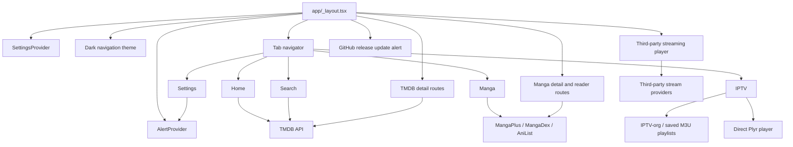

# Yummy Project Memory

## Snapshot

**Yummy** is a personal media client (`v2.1.0`) that combines:

1. TMDB discovery for movies, TV shows, people, cast, and recommendations.
2. Configurable third-party streaming-provider embeds (`app/player.tsx`: WebView on native, `<iframe>` on web/Tauri).
3. Public direct IPTV playback from IPTV-org and saved M3U playlists.
4. Manga discovery and reading via MangaPlus, MangaDex, and AniList.

The app is an Expo Router application with a dark, Netflix-inspired visual system: black/surface/card layers, red accent (`#e50914`), quiet uppercase labels, radius-8 chrome, white primary CTAs, and bundled Geist Mono (**Regular / Medium / SemiBold / Bold** only). Android is configured as `com.kunalkongkan.yummy`; web uses Expo static output. Desktop (Win / Linux / macOS) is a Tauri 2 shell around that web export (`src-tauri/`, identifier `com.kunalkongkan.yummy`). The native Android directory may exist locally but is ignored by Git.

## Runtime Structure

## Route Inventory

| Route | Role | Important parameters / dependencies |
| --- | --- | --- |
| `/(tabs)` | Bottom-tab shell | Defined by `app/(tabs)/_layout.tsx` |
| `/(tabs)/index` | Home discovery | TMDB credential; optional TMDB provider filter |
| `/(tabs)/search` | TMDB multi-search | TMDB credential; search starts at 3 characters |
| `/(tabs)/manga` | Manga source selector/search | MangaPlus device initialization; MangaDex or AniList network access |
| `/(tabs)/iptv` | IPTV playlist, group, and channel browser | IPTV-org plus saved M3U / custom channels |
| `/(tabs)/settings` | Stream provider, TMDB, IPTV playlists/channels | `SettingsContext`; AsyncStorage; `AppAlert` |
| `/details` | Movie/TV metadata, cast, seasons, recommendations | `id`, `type` (`movie`/`tv`) |
| `/person` | TMDB person profile and credits | `id` |
| `/iptv-player` | Direct Plyr IPTV playback | `channelName`, `streamUrl` |
| `/manga-details` | Source-specific metadata and chapter selection | manga ID, source, display metadata |
| `/manga-reader` | Page reader with zoom/pan and navigation | chapter ID/title, manga title, source |
| `/player` | Third-party stream provider embed | `id`, `type`, `title`, `season?`, `episode?` — WebView native / iframe web |

Root navigation is in `app/_layout.tsx`. It preloads the four Geist Mono weights, holds the splash until fonts resolve, wraps routes in `SettingsProvider` and `AlertProvider`, forces React Navigation's dark theme, and invokes `useVersionCheck()`.

## State Ownership and Persistence

### `SettingsContext`

`contexts/SettingsContext.tsx` owns all app-level settings:

| Value | Default | AsyncStorage key |
| --- | --- | --- |
| `streamUrl` | empty until user picks a provider | `@stream_url` |
| `tmdbApiKey` | empty string | `@tmdb_api_key` |
| `streamProvider` | empty until user picks after disclaimer | `@stream_provider` |
| `streamDisclaimerAccepted` | `false` | `@stream_disclaimer_accepted` (`1` when accepted) |
| `iptvPlaylists` | IPTV-org categories plus custom entries | `@iptv_playlists` (custom only) |
| `iptvChannels` | empty | `@iptv_channels` |
| `iptvFavorites` | empty | `@iptv_favorites` |
| `iptvRecentChannels` | empty, max 20 | `@iptv_recent_channels` |

Custom channels (`iptvChannels`) are individual direct stream URLs. They are marked `isCustom: true`, appear in the IPTV tab, and bypass M3U parsing.

Use `useSettings()` instead of direct AsyncStorage access in product features. Settings load asynchronously after mount; screens must tolerate defaults until persisted values arrive.

### MangaPlus device identity

`hooks/useMangaPlus.ts` has a singleton manager. On first use it registers a device against `EXPO_PUBLIC_MANGAPLUS_BASE_URL` and stores its ID/secret as `@mangaplus_device_id` and `@mangaplus_device_secret`. API calls require initialization and return safe empty values on most failures.

## Data and External Contracts

### TMDB

`hooks/useTMDB.ts` is the canonical client for discovery, search, media details, credits, recommendations, person profiles/credits, top-rated, upcoming, and TV season episodes. Values beginning with `eyJ` or longer than 100 characters are treated as bearer tokens; otherwise an API key query parameter is used. Shared types: `Movie`, `Season`, `Episode`, `CastMember`, `PersonDetails`, `PersonCredit`.

Screens should call `useTMDB()` methods only — do not duplicate auth headers in route files.

Provider-filtered popularity uses the `IN` region. Curated provider IDs/logos live in `constants/providers.ts`. Embed providers live in `constants/streamProviders.ts` (real names + hostnames; no alias nicknames). Playback requires accepting the third-party stream disclaimer (`constants/streamDisclaimer.ts`, gated via `utils/streamPlaybackGate.ts`) and selecting a provider in Settings — there is no silent default embed.

### IPTV

`constants/iptv.ts` defines the built-in IPTV-org category playlist. `hooks/useIptv.ts` parses `#EXTINF` into validated `IptvChannel` records, accepts only public HTTPS playlists without embedded credentials, accepts public direct HTTP(S) streams, caps playlists at 20,000 channels / 10 MB, and ignores playlist-provided header directives. The IPTV tab uses a virtualized `FlatList`, group/query filters, favorites/recents, and ignores stale load responses. `app/iptv-player.tsx` plays public HLS or MP4/M4V/WebM via hls.js + Plyr (WebView on native, `iframe` + `srcDoc` on web/Tauri with `parent.postMessage` bridge); it fails closed after 25 seconds for bad/DRM/origin-restricted streams.

### Manga

| Source | Discovery/details | Reading | Notes |
| --- | --- | --- | --- |
| MangaPlus | `useMangaPlus` | Chapter endpoint via same client | Device registration; English titles filtered |
| MangaDex | `api.mangadex.org` | At-Home server URLs | English chapter feed |
| AniList | `graphql.anilist.co` | Consumet AniList manga endpoint | Metadata only for reading; Consumet is unstable |

Source selection lives in `app/(tabs)/manga.tsx`. `manga-details.tsx` fetches source-specific details and opens the reader when chapters exist. The reader uses Gesture Handler / Reanimated for pinch/pan.

### Updates

`useVersionCheck()` compares GitHub Releases for `kunalkcube/yummy` with the running app version. On native it uses `expo-application`'s `nativeApplicationVersion`; on web/Tauri that API is always `null`, so it falls back to `Constants.expoConfig.version` (`app.json`). Root layout shows `UpdateAlert` when a newer release exists.

### Alerts

`components/AppAlert.tsx` provides a custom modal dialog. Imperative API: `AppAlert.alert(title, message?, buttons?)` with optional `cancel` / `destructive` / `default` button styles. `AlertProvider` must stay mounted in the root layout. Do not use React Native `Alert`.

## UI and Component Boundaries

- Design tokens: `constants/colors.ts`, `constants/fonts.ts` (four Geist Mono weights only).
- Desktop shell: `components/layout/ScreenContainer.tsx` centers content at `CONTENT_MAX_WIDTH` (896) when width ≥ 768 (`useIsDesktop`). Below that, mobile layout matches pre-desktop (no max-width column, uncapped heroes/cards, FlatList rows, no chevrons). `MovieCard` clamps 110–170 only on desktop. Tab chrome and `HorizontalScrollRow` chevrons follow the same breakpoint. Players stay full-bleed; web/Tauri uses `iframe`.
- Shared chrome language: quiet uppercase labels, radius 8, white primary buttons, accent-border selection, Lucide `Star` for ratings, safe-area aware headers, translucent player chrome.
- `MovieRow` / `MovieCard` — Home (and similar) horizontal lists → `/details`.
- `ProviderChips` — TMDB watch-provider filter on Home.
- `SeasonsList` — lazy season episodes with pagination.
- `AppAlert` — all confirmations and success/error dialogs.
- `UpdateAlert` — GitHub release prompt (same visual language as `AppAlert`).

Expo starter artifacts (themed components, `/modal`, `EmptyState`, debug helpers, unused font weights, `constants/theme.ts`) have been removed.

## Environment and Secrets

- `.env` is gitignored and must stay local. A real `TMDB_API_KEY` may exist there for local tooling; product code does **not** read it — users enter TMDB credentials in Settings.
- `EXPO_PUBLIC_MANGAPLUS_BASE_URL` is required at bundle time by MangaPlus. It is public configuration, not a secret store.
- Never commit API keys, bearer tokens, device secrets, or signing credentials.
- Do not log credential prefixes, lengths, or Authorization headers.
- Privacy: Yummy has no backend/server. Device-local AsyncStorage only; see Settings → About.

## Build, Quality, and Repository Facts

- Runtime: Expo SDK 57 / React Native 0.86 / React 19.2 / TypeScript 6.
- Package manager: npm with committed `package-lock.json`.
- Commands: `npm start`, `npm run android`, `npm run ios`, `npm run web`, `npm run lint`, `npm run reset-project`, `npm run tauri:dev`, `npm run tauri:build`.
- Splash / Android adaptive icon background: `#000000`. New Architecture is required (SDK 55+); do not set `newArchEnabled` or `android.edgeToEdgeEnabled` in `app.json`.
- TypeScript is strict; `@/*` resolves from the repo root.
- ESLint: Expo flat config (`eslint-config-expo` ~57); ignores `dist/*`. `react-hooks/set-state-in-effect` is off for intentional screen fetch effects.
- Tab bar types come from Expo Router’s vendored React Navigation (`expo-router/js-tabs` / `expo-router/react-navigation`). Do not import `@react-navigation/*` in app code (SDK 56+).
- `useTMDB` / key `useMangaPlus` methods are `useCallback`-stable so screen load effects do not re-fire every render.
- Tauri 2: `@tauri-apps/cli` in devDependencies; `src-tauri/tauri.conf.json` uses `frontendDist: ../dist`, `devUrl: http://localhost:8081`, `beforeDevCommand: npx expo start --web`, `beforeBuildCommand: npx expo export -p web`. Desktop bundles land in `src-tauri/target/release/bundle/`.
- `metro.config.js` must block `src-tauri/**` from Metro's watcher; otherwise `tauri:dev` crashes when cargo creates/deletes temp files under `target/debug/deps`.
- No automated test framework or in-repo CI release pipeline; personal APKs via local/`expo run` or EAS when configured; desktop via `npm run tauri:build`. Keep keystores/signing credentials out of git.
- Ignored: `dist/`, `.expo/`, `node_modules/`, `.env`, generated `/android` and `/ios`, `src-tauri/target/`, `src-tauri/gen/schemas`.
- Active branch historically: `github`; `v2.0.0` is the initial release tag.

## Known Maintenance Risks

1. **IPTV and scraper volatility:** Streams, MangaDex, MangaPlus, and Consumet can break without app changes. Keep parsing defensive; test on device.
2. **Large remote playlists:** IPTV-org is large (~14k channels). Keep lists virtualized; do not persist full remote playlists without a retention design.
3. **No automated tests:** Rely on lint/typecheck plus manual navigation and failure-path checks.
4. **Untrusted media surfaces:** User stream URLs and embedded WebViews/iframes are untrusted. On web/Tauri, `react-native-webview` is unsupported — players use native `iframe`. Keep URL validation, navigation allowlists, and log redaction.

## Update Guidance

Refresh this file when routes, persistence keys, runtime versions, API auth, IPTV/Manga contracts, UI system tokens, alert usage, quality commands, or known risks change. Keep it factual and short enough for session context.
