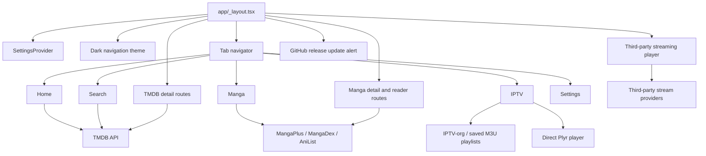

# Yummy Project Memory

## Snapshot

**Yummy** is a personal media client (`v2.0.0`) that combines:

1. TMDB discovery for movies, TV shows, people, cast, and recommendations.
2. Configurable third-party streaming-provider embeds in a WebView (`app/player.tsx`).
3. Public direct IPTV playback from IPTV-org and saved M3U playlists.
4. Manga discovery and reading via MangaPlus, MangaDex, and AniList.

The app is an Expo Router application with a dark, Netflix-inspired visual system: black/surface/card layers, a red accent, and bundled Geist Mono font weights. Android is explicitly configured as `com.kunalkongkan.yummy`; web uses Expo static output. The native Android directory is present locally but ignored by Git, so treat it as generated/local unless a task explicitly requires native changes.

## Runtime Structure

## Route Inventory

| Route | Role | Important parameters / dependencies |
| --- | --- | --- |
| `/(tabs)` | Bottom-tab shell | Defined by `app/(tabs)/_layout.tsx` |
| `/(tabs)/index` | Home discovery | TMDB credential; optional TMDB provider filter |
| `/(tabs)/search` | TMDB multi-search | TMDB credential; search starts at 3 characters |
| `/(tabs)/manga` | Manga source selector/search | MangaPlus device initialization; MangaDex or AniList network access |
| `/(tabs)/iptv` | IPTV playlist, group, and channel browser | IPTV-org plus saved M3U configurations |
| `/(tabs)/settings` | Stream provider, TMDB, and IPTV playlist settings | `SettingsContext`; AsyncStorage |
| `/details` | Movie/TV metadata, cast, and recommendations | `id`, `type` (`movie`/`tv`) |
| `/person` | TMDB person profile and credits | `id` |
| `/iptv-player` | Direct Plyr IPTV playback | `channelName`, `streamUrl` (playlist or custom channel) |
| `/manga-details` | Source-specific metadata and chapter selection | manga ID, source, display metadata |
| `/manga-reader` | Page reader with zoom/pan and navigation | chapter ID/title, manga title, source |
| `/player` | Third-party stream provider WebView | `id`, `type`, `title`, `season?`, `episode?` |
| `/modal` | Unused Expo starter modal | Not registered in the root stack |

Root navigation is in `app/_layout.tsx`. It preloads Geist Mono fonts, holds the splash screen until the font result is known, wraps routes in `SettingsProvider`, forces React Navigation's dark theme, and invokes `useVersionCheck()`.

## State Ownership and Persistence

### `SettingsContext`

`contexts/SettingsContext.tsx` owns all app-level settings:

| Value | Default | AsyncStorage key |
| --- | --- | --- |
| `streamUrl` | `https://player.videasy.net` | `@stream_url` |
| `tmdbApiKey` | empty string | `@tmdb_api_key` |
| `streamProvider` | `videasy` | `@stream_provider` |
| `iptvPlaylists` | IPTV-org categories plus custom entries | `@iptv_playlists` (custom only) |
| `iptvChannels` | empty | `@iptv_channels` |
| `iptvFavorites` | empty | `@iptv_favorites` |
| `iptvRecentChannels` | empty, max 20 | `@iptv_recent_channels` |

Custom channels (`iptvChannels`) are individual direct stream URLs added by the user. They are marked with `isCustom: true`, appear in the IPTV tab quick section, and can be favorited/played like playlist channels. They bypass M3U parsing entirely.

Use `useSettings()` instead of direct AsyncStorage access in product features. Settings load asynchronously after the provider mounts, so screens must tolerate their defaults before persisted values arrive.

### MangaPlus device identity

`hooks/useMangaPlus.ts` has a singleton manager. On first use it registers a device against `EXPO_PUBLIC_MANGAPLUS_BASE_URL` and stores its ID/secret as `@mangaplus_device_id` and `@mangaplus_device_secret`. Its API calls require initialization and return safe empty values on most failures.

## Data and External Contracts

### TMDB

`hooks/useTMDB.ts` is the canonical client for discovery, search, media details, and TV season episodes. It treats a value beginning with `eyJ` or longer than 100 characters as a bearer token; otherwise it sends an API key query parameter. Shared types are `Movie`, `Season`, and `Episode`.

Several detail screens call TMDB directly for endpoints not exposed from the hook:

- `app/details.tsx`: credits and recommendations
- `app/person.tsx`: person details and combined credits
- `app/(tabs)/index.tsx`: top-rated and upcoming lists

TMDB provider discovery is constrained to the `IN` region in `fetchPopular()` when a provider filter is selected. Provider IDs/logos are a curated list in `constants/providers.ts`.

### IPTV

`constants/iptv.ts` defines the built-in, category-grouped IPTV-org playlist: `https://iptv-org.github.io/iptv/index.category.m3u`. Its official repository documents the public M3U endpoints and explicitly notes that it links to streams rather than hosting video files.

`hooks/useIptv.ts` parses `#EXTINF` metadata into validated `IptvChannel` records, accepts only public HTTPS playlist configuration without embedded credentials or literal local-network targets, accepts public direct HTTP(S) stream URLs, limits a playlist to 20,000 channels / 10 MB, and ignores playlist-provided header or credential directives. The IPTV tab renders channels with a `FlatList`, filters by group and query, records local favorites/recents, and ignores stale playlist-load responses. `app/iptv-player.tsx` plays public direct HLS (including extensionless endpoints) or MP4/M4V/WebM streams through hls.js and Plyr; it fails closed after 25 seconds and shows an error for failed, DRM-protected, or origin-restricted streams rather than attempting an access-control bypass.

### Manga

| Source | Discovery/details path | Reading path | Notes |
| --- | --- | --- | --- |
| MangaPlus | Configurable base service through `useMangaPlus` | Configurable chapter endpoint | Official-style device registration; English titles are filtered |
| MangaDex | `api.mangadex.org` | At-Home server URLs | Chapter feed is requested in English |
| AniList | `graphql.anilist.co` | Consumet AniList manga endpoint | AniList provides metadata; reader depends on a separate unstable service |

Manga source selection and result transformation occur in `app/(tabs)/manga.tsx`. `manga-details.tsx` fetches source-specific details, exposes MangaPlus favorites, and navigates to the reader only when it has a chapter list. The reader uses React Native Gesture Handler/Reanimated for pinch/pan, which is why both packages remain initialized in the root layout.

### Updates

`useVersionCheck()` requests `kunalkcube/yummy`'s latest GitHub Release and compares the release tag with `expo-application`'s native application version. The root layout renders `UpdateAlert` only when a newer release exists. A missing native version is currently asserted as non-null, so this needs consideration if the app is expected to run in an environment without `nativeApplicationVersion`.

## UI and Component Boundaries

- `constants/colors.ts` and `constants/fonts.ts` are the product design tokens used by active screens.
- `MovieRow` composes horizontal `MovieCard` lists and navigates to `/details`.
- `ProviderChips` filters TMDB discovery on Home.
- `SeasonsList` lazily fetches episode lists and paginates long seasons.
- `EmptyState` provides a reusable settings-oriented fallback, though several screens still render custom empty states.
- `UpdateAlert` owns the release prompt.
- `components/themed-*`, `components/ui/*`, `haptic-tab.tsx`, `hello-wave.tsx`, `parallax-scroll-view.tsx`, `constants/theme.ts`, and `/modal` are Expo template artifacts rather than the active product style system.
- `DebugInfo.tsx` and `DirectAPITest.tsx` are legacy debug components and are not imported by application routes. Do not surface them in production UI or use them as examples for credential handling.

## Environment and Secrets

- `.env` is ignored and must remain local.
- The documented TMDB credential is entered through Settings and persisted locally; it is not read from an environment variable by product code.
- `EXPO_PUBLIC_MANGAPLUS_BASE_URL` is required at bundle time by the MangaPlus hook. Because it uses `EXPO_PUBLIC_`, it is public configuration, not a secret store.

- Legacy debug source contains embedded TMDB credentials. Treat them as compromised: never reuse them, avoid adding more, and rotate/remove them in a dedicated security change.

## Build, Quality, and Repository Facts

- Runtime: Expo SDK 54 / React Native 0.81 / React 19 / TypeScript 5.9.
- Package manager: npm with a committed `package-lock.json`.
- Available commands: `npm start`, `npm run android`, `npm run ios`, `npm run web`, `npm run lint`, and `npm run reset-project`.
- TypeScript is strict and `@/*` resolves from the repository root.
- ESLint is Expo's flat configuration and ignores `dist/*`.
- No automated test framework or test script exists.
- `dist/`, `.expo/`, `node_modules/`, `.env`, and generated `/android` and `/ios` folders are ignored.
- The active branch is `github`; the repository history currently identifies `v2.0.0` as the initial release tag.

## Known Maintenance Risks

1. **Credentials in legacy debug code:** Treat as exposed and remove/rotate through a focused security task.
2. **Duplicated TMDB authentication code:** Home, details, and person screens partly bypass `useTMDB()`, increasing the chance that auth/error handling diverges.
3. **IPTV and scraper volatility:** IPTV streams, MangaDex, the MangaPlus service, and the AniList reader dependency can break without application changes. Make parsing defensive and test on device.
4. **Large remote playlists:** IPTV-org is approximately 3 MB and has roughly 14,000 channels. Keep rendering virtualized and do not persist full playlists without a size/retention design. Custom channels are small and persisted locally.
5. **No automated tests:** Behavior changes need focused lint/type checks plus runtime validation of navigation and network failure states.
6. **Starter artifacts remain:** The repository has two theme/component systems. Keep product work on `constants/colors.ts` and `constants/fonts.ts` unless a deliberate consolidation is planned.
7. **Security/privacy:** User-supplied stream URLs and embedded WebView content are untrusted. Preserve URL validation, navigation controls, and redaction of sensitive values in logs.

## Update Guidance

Refresh this file when any of the following changes: routes, state ownership/persistence keys, package/runtime versions, API base URLs or auth approach, IPTV contracts, MangaPlus device lifecycle, quality commands, known risks, or architectural decisions. Keep it factual and short enough to be useful as session context.
