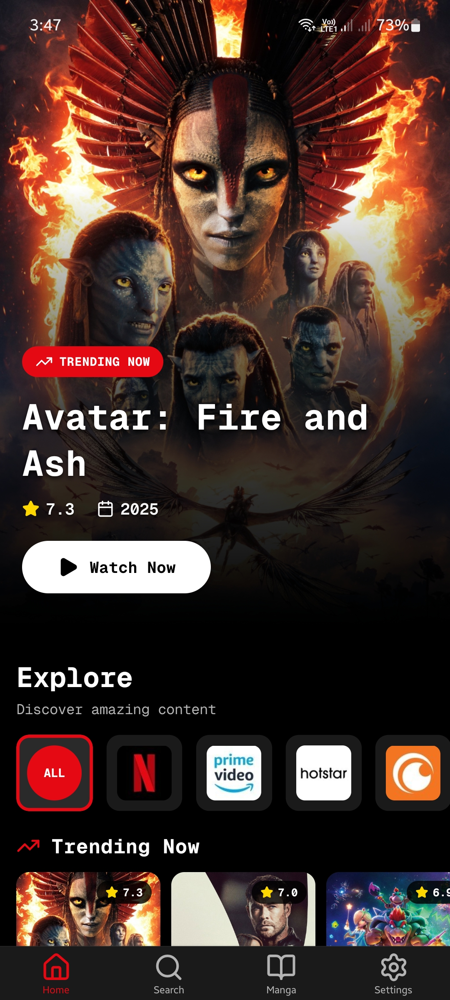
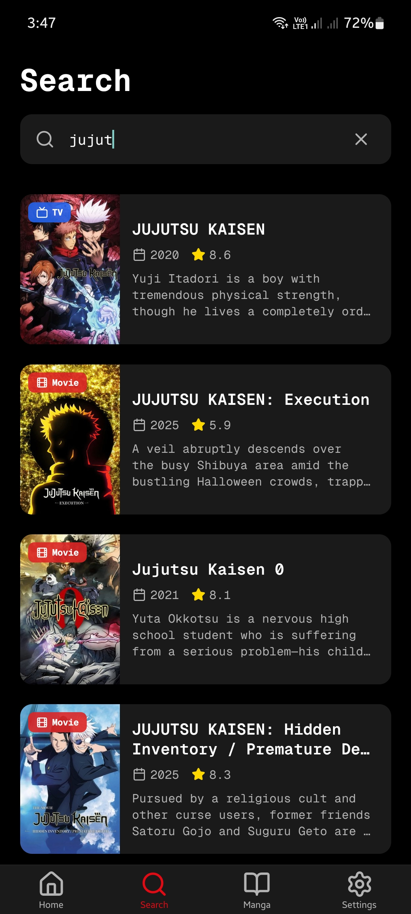
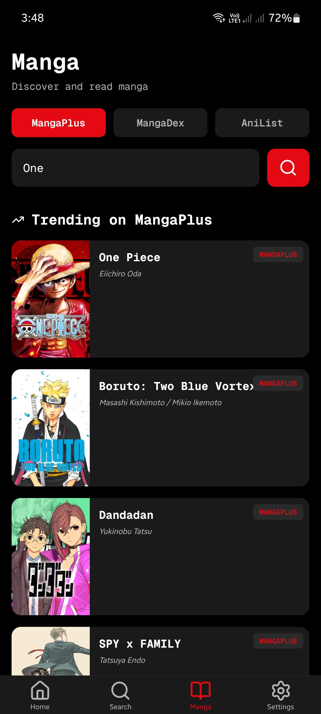
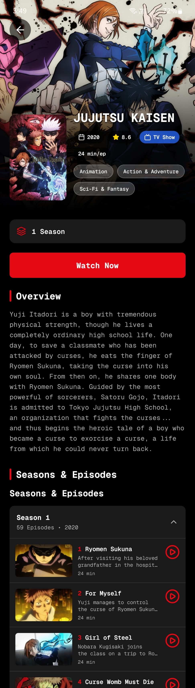
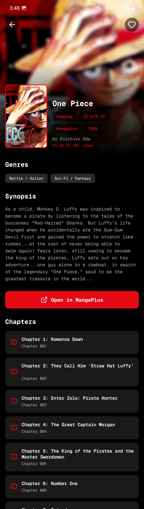

# Yummy

Personal media client for movies, TV, manga, and IPTV — built with React Native and Expo.

**v2.1.0** · dark Netflix-inspired UI · no Yummy backend (everything stays on-device)

<p align="center">
  
  
  
</p>

<p align="center">
  
  
</p>

## Features

### Movies & TV
- Browse trending, popular, top-rated, and upcoming titles via TMDB
- Filter Home by streaming provider chips
- Search the TMDB catalog
- Details with cast, seasons/episodes, and recommendations
- Person profiles and filmography
- Play through configurable third-party embed providers (WebView) after accepting an on-device risk notice; real hostnames shown in Settings
- In-player ad blocking (host blocklist + DOM/popup cleanup)

### Manga
- Discover and search via MangaPlus, MangaDex, and AniList
- Chapter list and gesture-based reader (pinch / pan)

### IPTV
- Built-in [iptv-org](https://github.com/iptv-org/iptv) category playlist
- Add public HTTPS M3U playlists and custom direct stream channels
- Favorites, recent channels, group/search filters
- Direct HLS / MP4 playback with Plyr

### App
- Custom tab bar and quiet dark chrome (Geist Mono)
- Settings for stream provider, TMDB credentials, and IPTV sources
- GitHub Releases update alert
- Privacy-first: AsyncStorage only — no Yummy server

## Stack

- Expo SDK 57 · React Native 0.86 · React 19.2 · TypeScript
- Expo Router · AsyncStorage · WebView · Reanimated

## Prerequisites

- Node.js + npm
- A free [TMDB API key](https://www.themoviedb.org/settings/api) (or read-access token)
- MangaPlus base URL if you use that source (`EXPO_PUBLIC_MANGAPLUS_BASE_URL`)

## Getting Started

```bash
git clone https://github.com/kunalkcube/yummy.git
cd yummy
npm install
cp .env.example .env
```

Edit `.env`:

```env
# Optional local reference — the app reads TMDB credentials from Settings
TMDB_API_KEY=your_tmdb_api_key_here

EXPO_PUBLIC_MANGAPLUS_BASE_URL=https://your-mangaplus-api-url.com/api
```

Start the app:

```bash
npm start
# or
npm run android
npm run ios
```

Then open **Settings**, paste your TMDB API key or bearer token, and pick a stream provider.

## IPTV

The IPTV tab ships with the category-grouped [iptv-org playlist](https://iptv-org.github.io/iptv/index.category.m3u).

- Add more playlists under **Settings → IPTV Playlists** (public HTTPS M3U only)
- Add single channels under **Settings → IPTV Channels**
- Streams must allow direct browser playback — DRM, auth-walled, or offline feeds will not play

## DNS

Some networks block TMDB. Use Cloudflare DNS if requests fail:

**Android:** Settings → Network → Private DNS → `one.one.one.one`

## Privacy

Yummy has **no backend**. TMDB credentials, IPTV playlists/channels, favorites, and MangaPlus device IDs stay on this device (AsyncStorage). Network traffic goes only to the third-party APIs you use (TMDB, IPTV playlists, manga sources, stream embeds).

## Commands

| Command | Description |
| --- | --- |
| `npm start` | Expo dev server |
| `npm run android` / `ios` / `web` | Platform targets |
| `npm run lint` | ESLint |
| `npx tsc --noEmit` | Typecheck |

---

Built by [kunalkcube](https://github.com/kunalkcube) · Licensed under [MIT](./LICENSE)
